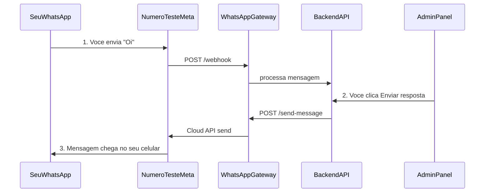

# Guia: gravar os 2 vídeos da App Review Meta

Roteiro prático para gravar os 2 vídeos exigidos pela Meta App Review: envio de mensagem pela plataforma Atende Ai até o seu WhatsApp pessoal (número de teste) e criação de template no backoffice.

Documento complementar: [meta-tech-provider-app-review.md](./meta-tech-provider-app-review.md).

---

## Antes de gravar (checklist técnico)

Confirme que tudo está rodando:

1. **Docker:** `docker compose up --build` em [`infra/`](../infra/)
2. **Túnel Cloudflare** ativo na porta 40000 (terminal separado):

   ```powershell
   cloudflared tunnel --url http://localhost:40000
   ```

3. **Webhook na Meta** apontando para `https://<seu-tunnel>.trycloudflare.com/webhook` com verify token = `META_VERIFY_TOKEN`
4. **Conta WhatsApp da Bella Massa** vinculada no backoffice (Phone Number ID + token válido)
5. **Seu celular cadastrado como destinatário de teste** na Meta:
   - Meta Developers → seu app → **WhatsApp** → **Configuração da API**
   - Em **Para / Recipient phone number**, adicione **seu número pessoal** (com DDI, ex. `+55 34 ...`)
   - Confirme o código que chegar no WhatsApp

Sem o passo 5, a plataforma **recebe** sua mensagem, mas **não consegue responder** (erro `#131030 Recipient phone number not in allowed list`).

### Passo 5 — cadastrar destinatário de teste (detalhado)

1. Acesse [developers.facebook.com](https://developers.facebook.com) → seu app → **WhatsApp** → **Configuração da API** (API Setup).
2. Role até **Para** (To) / **Recipient phone number**.
3. Clique em **Manage phone number list** ou **Add phone number**.
4. Informe seu número com DDI (ex.: `+55 34 9xxxx-xxxx`).
5. A Meta envia um código de 6 dígitos no WhatsApp — digite no painel.
6. Status deve ficar **Verified** antes de gravar o Vídeo 1.

---

## Com qual usuário logar?

| Vídeo | Usuário recomendado | Email | Senha | Por quê |
|-------|---------------------|-------|-------|---------|
| Vídeo 1 (mensagens) | **Admin da pizzaria** | `admin@bellamassa.com.br` | `Bella@2026!` | História clara: “empresa cliente usando a plataforma” |
| Vídeo 1 (alternativa) | Superadmin | `arthurlaranjo@hotmail.com` | `adminpanel` | Mostra operação SaaS; antes selecione tenant **Pizzaria Bella Massa** no backoffice |
| Vídeo 2 (templates) | Mesmo do vídeo 1 | idem | idem | Precisa ver aba WhatsApp + seção **Modelos WhatsApp (Meta)** |
| Envio de template (opcional, pós-APPROVED) | idem | idem | idem | Menu **Templates WhatsApp** → **Enviar teste** → `+55 34 99266-5547` |

Credenciais em [`CREDENCIAIS_TESTE.md`](../CREDENCIAIS_TESTE.md).

**Recomendação:** use **`admin@bellamassa.com.br`** nos dois vídeos — é mais simples (já entra direto no tenant `pizzaria_bella_massa`).

---

## Vídeo 1 — `whatsapp_business_messaging`

**O que a Meta quer ver:** sua plataforma **enviando** uma mensagem e o **WhatsApp do celular recebendo**.

Existem **dois caminhos**. Prefira o **Caminho A** (mais claro para o revisor).



### Caminho A — Resposta manual pelo painel (melhor para o vídeo)

**Prepare a conversa (antes de gravar):**

1. Abra o admin: `flutter run -d chrome` (ou URL publicada)
2. Login: `admin@bellamassa.com.br` / `Bella@2026!`
3. No celular, envie **"Oi"** para o **número de teste Meta** (ex. `+1 (555) 676-7862`)
4. Aguarde alguns segundos — pode chegar resposta automática da Bella Massa (opcional)

**Gravação (~2 min):**

| Tempo | O que mostrar na tela |
|-------|------------------------|
| 0:00 | Landing https://eletronica2.github.io/chatbot/ (opcional) |
| 0:15 | Login no painel |
| 0:30 | Menu **Conversas** (sidebar do dashboard) |
| 0:45 | Abrir a conversa com **seu número** |
| 1:00 | Digitar texto ex.: *"Olá! Esta mensagem foi enviada pela plataforma Atende Ai."* |
| 1:10 | Clicar **Enviar** |
| 1:20 | **Mostrar o celular** recebendo a mesma mensagem no WhatsApp |
| 1:40 | (Opcional) Terminal Docker com log do gateway enviando para Graph API |

**Onde clicar no painel:**

- Sidebar → **Conversas** → clique na linha do seu número → campo de resposta em [`conversation_detail_screen.dart`](../admin-panel/lib/screens/conversation_detail_screen.dart)
- O envio chama `POST /api/v1/conversations/{id}/reply` → gateway [`/send-message`](../backend-api/app/api/routes/conversations.py)

### Caminho B — Só automação (alternativa)

1. Envie "Oi" do celular para o número de teste
2. Mostre no terminal: `POST /webhook` + resposta automática
3. Mostre a **resposta da Bella Massa** chegando no celular

Funciona, mas o revisor pode achar menos óbvio que “foi a plataforma” — por isso o Caminho A é preferível.

### Direção das mensagens (importante)

| Direção | Quem faz | Para quem |
|---------|----------|-----------|
| Criar conversa | **Você** no celular | Número de teste Meta `+1 555...` |
| Plataforma responde | Painel **Conversas → Enviar** | **Seu número pessoal** (cadastrado como destinatário de teste) |

Você **não** manda mensagem “do painel para o número de teste” — manda **do painel para o seu celular**, usando a linha de teste da Meta como remetente.

---

## Vídeo 2 — `whatsapp_business_management`

**O que a Meta quer ver:** criação de **modelo de mensagem WhatsApp** (template oficial), não fluxo YAML.

**Pré-requisito:** conta WhatsApp da Bella Massa vinculada com token válido (WABA ID = `account_key` no cadastro).

**Gravação (~2 min):**

| Tempo | O que mostrar |
|-------|----------------|
| 0:00 | Login `admin@bellamassa.com.br` |
| 0:15 | **Backoffice** → aba **WhatsApp** |
| 0:25 | Conta vinculada visível (Phone Number ID) |
| 0:35 | Rolar até **Modelos WhatsApp (Meta)** em [`whatsapp_meta_panels.dart`](../admin-panel/lib/widgets/whatsapp_meta_panels.dart) |
| 0:50 | Preencher: nome `boas_vindas_atendimento`, categoria `UTILITY`, idioma `pt_BR`, corpo da mensagem |
| 1:10 | Clicar **Criar modelo** |
| 1:20 | Mostrar na lista status **PENDING** |

Se der erro de token/permissão, renove o **Access Token** temporário na Meta e atualize no backoffice antes de gravar.

---

## Problemas comuns durante a gravação

| Sintoma | Causa | Solução |
|---------|-------|---------|
| Mensagem não chega no celular | Seu número não está em destinatários de teste | Meta → API Setup → adicionar e verificar seu número |
| Conversa não aparece no painel | Webhook/túnel parado ou tenant errado | Reinicie túnel; use login Bella Massa ou selecione tenant no backoffice |
| Erro ao enviar resposta | Token expirado | Gere token novo na Meta e atualize conta WhatsApp |
| `#131030` no log | Destinatário não permitido | Cadastre seu celular como test recipient |
| `#131031` / `Business Account locked` | WABA bloqueada (pagamento, política ou dados) | Ver [`meta-waba-locked-131031.md`](./meta-waba-locked-131031.md) e rodar `scripts/check-meta-health.ps1` |
| Template não cria | Token sem permissão `whatsapp_business_management` | Submeta App Review ou use token de dev com escopo correto |

---

## Ferramentas para gravar

- **OBS Studio** ou gravador de tela do Windows
- Grave **tela do painel + celular** (câmera secundária ou espelhamento do WhatsApp Web no mesmo vídeo)
- Formato MP4, ~1–3 min cada, sem editar demais
- Áudio opcional; narração curta ajuda: *“Admin da pizzaria envia resposta pelo painel Atende Ai”*

---

## Ordem sugerida no dia da gravação

1. Subir Docker + Cloudflare
2. Renovar **Access Token** na [API Setup](https://developers.facebook.com/apps/873826165763092/whatsapp-business/wa-dev-console/) e salvar em **Clientes → WhatsApp**
3. Testar fluxo completo **uma vez sem gravar** (mensagem celular → conversa no painel → enviar resposta → chegar no celular)
4. Gravar **Vídeo 1** (mensagens)
5. Gravar **Vídeo 2** (template → status **PENDING**)
6. (Opcional) Após template **APPROVED**, testar **Templates WhatsApp** → **Enviar teste**
7. Anexar na Meta App Review com o texto sugerido em [`meta-tech-provider-app-review.md`](./meta-tech-provider-app-review.md) e checklist em [`app-review-submission.md`](./app-review-submission.md)

---

## Smoke test rápido (antes de gravar)

Execute na raiz do projeto:

```powershell
powershell -ExecutionPolicy Bypass -File scripts/smoke-test-app-review.ps1
```

O script verifica:

- Containers Docker (mysql, backend, gateway, flow-engine)
- GET `/webhook` (verify token)
- Health do backend
- Conta WhatsApp da Bella Massa no banco
- Login API e listagem de conversas (se credenciais disponíveis)

---

## Submissão App Review (checklist final)

- [ ] Vídeo 1 (`whatsapp_business_messaging`) gravado e salvo em MP4
- [ ] Vídeo 2 (`whatsapp_business_management`) gravado e salvo em MP4
- [ ] URLs públicas preenchidas no app Meta:
  - Landing: https://eletronica2.github.io/chatbot/
  - Privacy: https://eletronica2.github.io/chatbot/privacy.html
  - Terms: https://eletronica2.github.io/chatbot/terms.html
  - Data Deletion: https://eletronica2.github.io/chatbot/data-deletion.html
- [ ] App Review notes (copiar de [meta-tech-provider-app-review.md](./meta-tech-provider-app-review.md))
- [ ] Permissões solicitadas: `whatsapp_business_messaging` e `whatsapp_business_management` (Advanced Access)
- [ ] Anexar os dois vídeos na submissão
